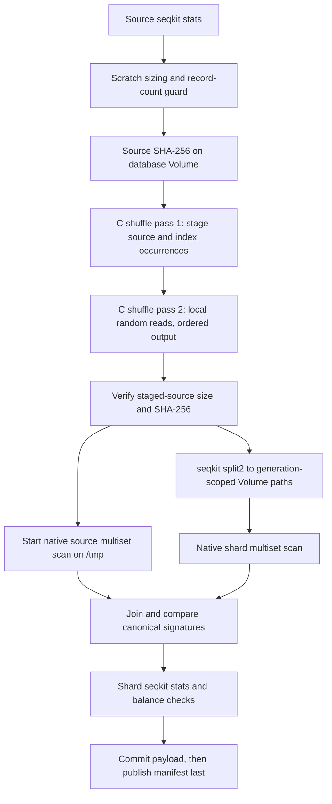

# AlphaFold3 MSA sharding and resumable inference

Status: accepted.

This record consolidates and supersedes ADRs 0005–0048 as they appeared in
branch history. It is the authoritative architecture decision for the
AlphaFold3 sharded-MSA integration.

## Context

The existing production app runs AlphaFold's full data pipeline in coarse
containers. A preemption can discard successful database searches, and cold
workers may copy hundreds of gigabytes of databases to local SSD.

AlphaFold's pinned Jackhmmer and Nhmmer wrappers support sharded FASTA paths.
Correct sharding requires the full-database HMMER search space and the pinned
global merge behavior.

The Phase 1 small-BFD campaign validated 64 shards for the tested protein
queries. Equal-score hit permutations were scientifically equivalent; target,
score, alignment, and non-tied ordering mismatches were not.

The selected worker topology was 16 active shard searches with two HMMER CPUs
each in a Modal container allocated `(0.125, 32.125)` CPUs. It completed the
medium query in about 49.05 seconds, roughly 5.1 times faster than the baseline.

The campaign did not show Modal Volume bandwidth to be the primary bottleneck
for HMMER search. Prediction workers therefore read uncompressed shards
directly from the Volume and do not copy sequence databases to ephemeral SSD.

Stock SeqKit shuffling exposed a different access pattern. Its serialized
random reads from the monolithic source produced only about 1.9 MB/s for
UniProt, so the one-time profile builder stages that source on ephemeral SSD
before randomized output.

The original aggregate `seqkit sum --all` validation also ignored FASTA
headers and turned the shard union into one serial input with a global
per-sequence hash sort. The replacement C validator's measured source scan was
slower than the source-side SeqKit checksum, but its complete UniProt
source-plus-256-shard scan took 10m 02s and compared the multiplicity-sensitive
full `(header, sequence)` multiset.

## Decision

### Ownership and upstream compatibility

Biomodals owns profile selection, cache lookup, missing-work scheduling,
publication, and resume behavior. The pinned AlphaFold source remains unaware
of Modal Volumes, claims, and completion markers.

The app does not patch `_get_protein_msa_and_templates` to discover persistent
cache entries. A narrow app-owned adapter preserves the pinned upstream search,
merge, deduplication, and template semantics.

Contract checks bind that adapter to the pinned AlphaFold source. An upstream
pin change requires comparison against the new source before its results can
reuse these scientific cache paths.

Mature construction primitives live under
`src/biomodals/app/fold/alphafold3/`. That package owns the pinned C source
assets, source-code identities, native compilation and execution, record
multiset parsing, scratch sizing, and staged-file verification. It has no
knowledge of Modal Volumes, profile manifests, benchmark campaigns, or
publication claims.

The temporary MSA Benchmark App remains the composition root while the
sharding recipe is being validated. It owns Modal images and resources,
profile orchestration, SeqKit splitting, durable evidence, and publication.
After the scientific gates pass, the production AlphaFold3 app imports the
same mature sharding package rather than copying its native implementation.

### Fixed database specifications

Production accepts one code-owned `database_id`. It does not accept arbitrary
source paths, shard counts, polymer types, Z values, or profile IDs.

| Database ID | Profile ID | Source FASTA | Shards | Polymer |
| --- | --- | --- | ---: | --- |
| `small_bfd` | `small-bfd-64-v2` | `bfd-first_non_consensus_sequences.fasta` | 64 | protein |
| `mgnify` | `mgnify-512-v1` | `mgy_clusters_2022_05.fa` | 512 | protein |
| `uniprot` | `uniprot-256-v1` | `uniprot_all_2021_04.fa` | 256 | protein |
| `uniref90` | `uniref90-128-v1` | `uniref90_2022_05.fa` | 128 | protein |
| `ntrna` | `nt-rna-256-v1` | `nt_rna_2023_02_23_clust_seq_id_90_cov_80_rep_seq.fasta` | 256 | RNA |
| `rfam` | `rfam-16-v1` | `rfam_14_9_clust_seq_id_90_cov_80_rep_seq.fasta` | 16 | RNA |
| `rnacentral` | `rnacentral-64-v1` | `rnacentral_active_seq_id_90_cov_80_linclust.fasta` | 64 | RNA |

Each specification also fixes the source snapshot guards, construction recipe,
SeqKit version and seed, and AlphaFold compatibility pin. A scientific change
requires a new Profile ID and a reviewed app deployment.

`small-bfd-64-v1` remains immutable benchmark evidence. The production
candidate uses `small-bfd-64-v2` because it stages shuffle/index data under
`/tmp` and does not retain the monolithic FASTA inside the profile.

`seqkit_threads` controls SeqKit statistics/splitting and the native shuffler
and validator workers. It is operational: changing it does not select a
different scientific specification or Profile ID, and ordered output makes the
permutation independent of worker completion order.

### Immutable profile layout

Sharded profiles live in the separate `AlphaFold3-msa-db-sharded` Modal Volume:

```text
/profiles/{profile_id}/
  shards/
  validation/
  manifest.json
```

`manifest.json` is the readiness marker and is always written last. There is no
mutable `current` pointer, automatic discovery, or automatic promotion.

The manifest preserves source identity and statistics. The published profile
does not retain a duplicate monolithic source FASTA.

Rebuilding an identical specification reuses its valid publication and never
overwrites it. A new Profile ID leaves the previous profile available so old
Search Identities retain their provenance.

### Profile builder

The production app exposes one builder operation:

```python
build_sharded_database(
    database_id: str,
    seqkit_threads: int = 8,
    source_policy: Literal["keep", "compress", "delete"] = "keep",
) -> dict[str, object]
```

One invocation builds one logical database. It uses `(0.125, 32.125)` CPUs,
`(1024, 262144)` MiB requested/maximum memory, and the default 512 GiB
ephemeral disk without requesting a larger disk.

The builder reads the official monolithic FASTA from `AlphaFold3-msa-db`. It
writes an ephemeral source copy, the two-pass shuffled FASTA, and a compact
occurrence-offset index under `/tmp`. It never copies the monolithic source
into the sharded Volume.

Source `seqkit stats` remains serialized before shuffling. Its observed record
count is a data dependency for exact scratch sizing and the native shuffler's
`--expected-records` guard, so running it concurrently would not shorten the
critical path without weakening those checks.

The first pass scans the source sequentially, tees the exact bytes into the
container-local copy, and indexes every record by source occurrence in a
fixed-width `uint64` offset array. The helper syncs the local copy, closes the
Volume file, and creates a seed-23, SplitMix64 Fisher--Yates permutation of
`uint32` ordinals. The second pass uses bounded concurrent `pread` calls
against only the local copy, but buffers and writes each batch in permutation
order. The helper normalizes a missing final newline so moving the last source
record cannot merge it with the next header.

Before work starts, the builder requires scratch for the exact source copy,
normalized shuffled output, occurrence index, and 1 GiB headroom. This is
about 204.68 GiB for UniProt and 245.15 GiB for MGnify, both below Modal's
default 512 GiB per-container disk quota.

Occurrence identity preserves duplicate full headers without FAI lookup,
temporary header prefixes, or recovery. The manifest pins the helper source
digest, offset representation, permutation, and ordered-read behavior.

After shuffling, the builder checks the staged source's size and SHA-256 against
the source identity already read from the database Volume. Only that
cryptographically verified local copy can serve as the source-side validation
oracle.

The builder then starts the source-side C record-multiset scan on the local SSD
copy and runs `seqkit split2` on the main path. After splitting, it starts the
shard-side C scan. The source scan may overlap both operations, but the two
signatures are joined before comparison and publication. A one-worker Python
thread pool only launches and waits for the native C subprocess; the scans do
not execute Python bytecode and are not serialized by the Python GIL.



Generation-scoped raw shards are written to the sharded Volume; the ephemeral
source copy, occurrence index, and shuffled FASTA are never written to a
persistent Volume.

After splitting, the builder deletes the shuffled payload and renames each
generation-scoped raw shard to its exact AlphaFold-compatible filename.

Construction is the scientific trust boundary. Before publication, the builder
checks all of the following:

- source and aggregate-shard `seqkit stats`;
- sequence and residue conservation;
- an order-independent, multiplicity-sensitive C validation of the complete
  canonical `(header, sequence)` multiset;
- occurrence-index construction and native shuffler metrics;
- duplicate-header occurrence preservation with no recovery prefixes;
- exact shard names, count, balance, sizes, and digests;
- source identity, recipe, and declared compatibility.

The validator hashes each full header, concatenated sequence, and explicit
header and sequence lengths with SHA-256. Header and sequence case are
significant; line endings and sequence wrapping are not. It combines all four
64-bit digest lanes with modular sums, XORs, and sums of squares, plus exact
record, header-byte, and sequence-byte totals. The source and aggregate shard
signatures must match. SeqKit is not used for aggregate checksums in new
profiles; it remains responsible for `stats` and `split2`.

For protein profiles, HMMER Z and domZ equal the exact source sequence count.
For RNA profiles, Nhmmer Z equals the exact nucleotide count divided by
1,000,000 and has megabase units.

The manifest records integer source statistics, the derived search-space value
and unit, source digests, shard artifacts, and recipe. Code-owned expected
statistics are guards; a mismatch fails publication for inspection.

After the shard payload is committed, the builder writes the manifest last and
deeply revalidates the published profile. Failure cleanup removes only that
generation's partial shards and retains compact diagnostics.

Profiles already published with the earlier SeqKit FAI recipe remain accepted
under recipe version 3. Occurrence-indexed profiles published with the C
shuffler and SeqKit sequence checksum remain accepted under recipe version 4.
New builds use recipe version 5: the occurrence-indexed C shuffler and
full-record C validator together. Existing immutable profiles are not rebuilt
solely to revise their validation recipe; every selected profile must still
pass the same database-search oracle before production promotion.

Normal search workers trust the published profile. They may read its small
manifest for identity and Z, but they never stat, hash, walk, or run SeqKit over
shards before searching.

A missing or unreadable shard fails that database search. Full profile
revalidation is an explicit audit operation, not part of query execution.

### Profile build claims

Before building, the app reuses a matching published profile or elects one
builder per Profile ID with atomic Modal Dict insertion.

The minimal claim uses append-only owner and terminal-status records by
generation. It has no polling loop or heartbeat.

An active conflict fails immediately. Normal failure records `failed`; work
older than the maximum function lifetime plus a margin may be marked
`abandoned`, allowing one later generation to take ownership.

Claims are never publication evidence and owner records are never deleted.
Only a validated manifest proves completion. Different Profile IDs may build
concurrently.

The production batch entrypoint will therefore submit every missing Supported
Database Specification concurrently. Each child invocation still builds one
logical database and is independently bounded by its Profile Build Claim.

### Source FASTA policy

`source_policy="keep"` is the default. The source is never changed before the
profile is committed and deeply revalidated.

`compress` writes `<complete-source-filename>.zst` beside the source. It checks
that decompression reproduces the recorded byte count and SHA-256 before it
commits the archive and removes the plain FASTA.

`delete` removes the plain source only after the explicit request and successful
profile publication.

Compression or verification failure leaves the plain source intact. Source
retirement is recorded and does not alter the immutable profile identity.

The builder accepts only the uncompressed official source. If only its `.zst`
archive exists, it fails with instructions to restore the source manually in a
Modal Sandbox or equivalent environment.

The app does not implement automatic restoration or an implicit full-database
decompression.

### MSA cache namespace and retry boundary

`sequence_hash` hashes validated sequence text only. Protein and RNA use
separate top-level namespaces:

```text
/Protein/{sequence_hash[:2]}/{sequence_hash}/
/RNA/{sequence_hash[:2]}/{sequence_hash}/
```

Legacy unnamespaced entries are ignored rather than migrated.

The durable retry boundary is one Raw Database MSA: one unique polymer and
sequence searched against one immutable database profile.

Its cache path is:

```text
/{polymer}/{prefix}/{sequence_hash}/
  raw-msa/{database_id}/{search_identity}/
    result.a3m
    metrics.json
    run.log
    done.json
```

`done.json` is written last and validates the database-level result and compact
provenance. Per-shard tblout files are transient worker scratch and are not
published in production.

A preempted worker reruns that whole database. Per-shard durable scheduling and
repair remain outside the initial design.

Search Identity covers polymer and sequence, the immutable profile manifest,
pinned AlphaFold and HMMER behavior, and every result-affecting search
parameter.

CPU allocation, HMMER CPU count, active shard count, and container topology are
operational settings outside Search Identity.

### Combined MSA and template publications

Canonical combined files remain flat at the sequence root:

```text
unpaired.a3m
paired.a3m
combined.done.json
templates.json
templates.done.json
```

RNA has no `paired.a3m` or template files. `combined.done.json` binds the
combined files to exact Raw Database MSA markers, upstream merge semantics,
sizes, and digests.

Only the latest canonical combination is retained at the flat paths. Older
combinations remain reconstructable from immutable raw results.

Unmarked legacy combined or template files are not cache hits. They remain
untouched until a complete canonical replacement is ready, then its marker is
written last.

Protein template search is a separate durable stage after unpaired-MSA
resolution. It always publishes `templates.json`, including a valid empty list,
then writes `templates.done.json` last.

Only the latest validated template publication is retained at the flat path. A
marker mismatch reruns template search without invalidating raw MSAs.

Template identity binds the resolved unpaired-A3M digest, maximum template date,
pinned tool behavior, and result-affecting parameters.

The fixed `pdb_seqres_2022_09_28.fasta` and `mmcif_files/` paths are an immutable
operator-controlled template store. Their inventory and digests are excluded
from cache identity.

Changing those files in place is unsupported and requires explicit template
cache removal or a future identity-policy revision.

The template worker reads PDB seqres and selected mmCIF files directly from the
source database Volume. It does not copy the reference store into the MSA cache
or local SSD.

The pinned pipeline limits selected templates to four. The cache stores only
their AlphaFold records, mappings, and serialized structures.

### Search claims and publication safety

Expensive search publications use append-only generation claims. A claim is
scheduling state; only its validating completion marker proves reuse.

Raw-result claims use:

```text
(polymer, sequence_hash, database_id, search_identity)
```

Combined-MSA claims are path-scoped by `(polymer, sequence_hash)`. Template
claims are path-scoped by protein `sequence_hash`.

The desired dependency identity lives in the claim generation and completion
marker, not in the flat-path claim key.

A writer publishes only while it owns the current generation. Other requests
wait, reload, and validate the marker rather than duplicating expensive work.

Failed or conservatively expired work advances to another generation. Claims
are not blindly deleted, so a superseded writer cannot replace a newer
publication.

### Caller evidence and deduplication

Canonical database work is deduplicated by `(polymer, sequence)`. Generated
canonical results may populate missing fields on identical-sequence chains.

Caller-supplied MSAs and templates remain attached to their original chain.
They are never copied to an identical sibling and never published into the
shared sequence cache.

A canonical combined MSA is published only when every constituent came from
validated canonical raw results.

A canonical template result is published only when its input was the canonical
combined unpaired MSA. Mixed caller/generated assemblies and templates stay
request-local.

Request-local template work may be deduplicated only when both the protein
sequence and resolved unpaired-MSA digest match.

### Search policy

The production entrypoint exposes `search_msa` and
`search_protein_templates`, both defaulting to true.

| MSA search | Template search | Field behavior |
| --- | --- | --- |
| On | On | Preserve non-empty fields and populate every missing MSA and protein template field. |
| On | Off | Populate missing MSAs, preserve non-empty templates, and set missing or null protein templates to `[]`. |
| Off | Either | Run no searches, preserve supplied fields, set missing MSAs to `""`, and set missing or null protein templates to `[]`. |

With MSA search enabled, fields resolve independently:

- missing protein unpaired MSA uses UniRef90, small BFD, and MGnify;
- missing protein paired MSA uses UniProt only;
- missing RNA unpaired MSA uses RFam, RNAcentral, and NT-RNA;
- requested missing protein templates run after unpaired-MSA resolution.

A non-empty field suppresses only the searches needed for that field. The app
does not run unnecessary canonical searches merely to populate the cache.

### Search worker topology

The entrypoint replaces `search_chains_in_parallel` and
`max_parallel_data_pipelines` with:

```python
max_parallel_search_workers: int = 4
```

This request-wide limit applies after duplicate sequences and valid cache hits
are removed.

The MSA phase schedules one Modal worker per missing
sequence-by-database result. The worker owns all internal shard fanout and uses:

- Modal CPU `(0.125, 32.125)`;
- HMMER `n_cpu=2`;
- at most 16 active shards;
- direct read-only access to `AlphaFold3-msa-db-sharded`.

The CPU floor may rise after measurements if non-search phases are starved.
Such an operational change does not invalidate scientific cache entries.

After all required MSAs finish, the template phase schedules one worker per
unique required protein. It uses upstream's fixed eight-CPU hmmsearch and is
not sharded.

Both phases share the same worker budget and never overlap. There is no
separate template-concurrency control initially.

### Upstream assembly and RNA gate

The app-owned adapter constructs combined alignments in pinned upstream order:

- protein unpaired: UniRef90, small BFD, then MGnify with deduplication;
- protein paired: UniProt without cross-database deduplication;
- RNA unpaired: RFam, RNAcentral, then NT-RNA with deduplication.

RNA profile selection is gated by the documented 25-nucleotide query:

```text
GGCCCGAUAGCUCAGUCGGUAGAGC
```

The monolithic result must contain at least one non-query hit. Otherwise a
longer documented RNA query must replace the fixture before the gate can pass.

For RFam, RNAcentral, and NT-RNA separately, the oracle compares monolithic and
sharded identities, scores, E-values, and aligned-sequence multisets using the
same full-database Z.

It also compares the final deduplicated RNA unpaired A3M. Only permutations
inside exact equal-score groups are scientifically equivalent.

Every selected RNA profile must pass against the exact pinned AlphaFold and
HMMER behavior before production uses it.

### Enriched input boundary

The Biomodals coordinator is the complete CPU data stage. It fails closed when
requested search evidence is incomplete.

After all required MSAs and templates exist, it validates an Enriched AlphaFold
Input and invokes upstream with:

```text
--run_data_pipeline=false
--run_inference=true
```

The old `run_data_pipeline` subprocess and `copy_msa_to_ssd` path are removed.
Upstream inference still performs input processing, featurization, model
execution, and output writing.

### Local path materialization

Before remote work, a local helper resolves relative input paths against the
input JSON's directory.

It reads protein and RNA `unpairedMsaPath` and protein `pairedMsaPath` into
inline MSA strings, then clears those path fields.

It reads `userCCDPath` into inline `userCCD` and clears the path. CCD content,
not its source path, participates in inference identity.

Every inline/path pair is mutually exclusive. Simultaneously populated forms
are rejected as ambiguous.

For each caller `mmcifPath`, the helper reads the file and computes its full
SHA-256 before run identity.

The identity representation substitutes that digest for the path while
retaining `queryIndices` and `templateIndices`. Inline mmCIF uses the same
content-digest representation.

After `run_id` is known, each path-backed template is uploaded once to:

```text
<run-root>/custom-templates/{sha256}.cif
```

The worker input rewrites `mmcifPath` to the mounted path. Identical content is
deduplicated within the run, while inline mmCIF remains inline.

### Inference identity

An app-local `hash_sequences` helper derives `run_id` from the normalized
Inference Identity View and seed-independent inference fragments.

The view validates through `AF3Config`, dumps defaults explicitly, removes only
`name` and `modelSeeds`, and replaces operational custom-template paths with
content digests.

It retains sequence order, chain IDs, descriptions, modifications, bonds,
MSAs, templates and mappings, custom CCD content, dialect, schema version, and
every other validated input field.

Additional fragments cover recycle count, diffusion-sample count, pinned app
and upstream identity, a code-owned model checkpoint label, and the
run-identity schema label.

Run identity excludes display name, model seeds, GPU accelerator class and
count, worker counts, container partitioning, search policy, and local or
remote paths.

The GPU class may be recorded as provenance. Cache reuse accepts small
hardware-dependent floating-point differences and does not promise bitwise
reproducibility across supported accelerators.

The app does not hash `af3.bin`. The declared checkpoint label and pinned app
identity treat the model file as immutable in place.

Replacing model weights in place without changing the label can reuse old
predictions. An intentional replacement must bump the label or explicitly
clear affected run cache entries.

### Run and request layout

The AlphaFold3 output Volume stores each run directly at:

```text
/{run_id[:2]}/{run_id}/
```

There is no top-level `runs/` directory. The run root contains:

```text
inputs/identity.json
custom-templates/{sha256}.cif
outputs/
outputs/.workers/{claim-generation}/
requests/{request_id}/
.markers/seeds/{seed}.json
.markers/summary.json
logs/
metrics/
```

`run_id` identifies one enriched input and seed-independent inference
configuration. Different seed requests and display names share the same run
root.

The submitted seed list must be non-empty. It is normalized to a sorted unique
set before identity, reconciliation, or scheduling.

The request manifest preserves submitted and normalized seeds and records any
duplicates removed by normalization.

`request_id` is derived with `hash_sequences` from `run_id` and the canonical
normalized seed list. It identifies a return view, not a seed cache entry.

### Seed claims and inference workers

Before scheduling, the coordinator trusts each matching Seed Completion Marker.
Directory existence or an earlier request manifest is not completion evidence.

Requested marked seeds are reused. Each unmarked `(run_id, seed)` is elected
through an append-only Seed Build Claim using atomic Dict insertion.

Claims are acquired per seed before owned seeds are grouped into at most
`max_num_gpus` disjoint, balanced worker lists. The same seed is never assigned
to two workers.

A GPU container may receive multiple seeds, matching upstream
`process_fold_input` behavior.

Each worker writes upstream output into exclusive
`outputs/.workers/{claim-generation}/` staging. Concurrent upstream processes
never share an output directory.

The worker input uses the Canonical Output Name:

```text
af3-{run_id[:16]}
```

The pinned model discards that target name before inference, so it does not
change scientific computation. It does make every durable output basename
independent of the caller's display name.

After upstream exits successfully, the wrapper promotes only assigned
seed-specific sample, embedding, and distogram directories into shared
`outputs/`.

It checks the complete expected output for every assigned seed before
promotion.

It commits those directories, then writes one Seed Completion Marker per seed
last. Worker-local shared ranking and best files are not canonical.

The marker binds run, seed, and owning claim generation. It also stores
`(sample_index, ranking_score)` rows for summary reconstruction.

The marker is deliberately not an artifact inventory. Reconciliation trusts it
without scanning sample files, recomputing digests, or parsing confidence
outputs.

A directory without a marker is incomplete and that whole seed reruns later.
Post-publication artifact corruption is an accepted risk.

### Global and request summaries

The Inference Run Summary covers the accumulated union of every marked Seed
Prediction under the run root. Later requests may add seeds but never remove
previously summarized seeds.

A path-scoped Summary Build Claim serializes finalization. The finalizer reloads
markers after taking ownership and builds from that exact completed-seed union.

It publishes ranking and global-best files before writing the summary marker
last. It may publish only if its seed set contains every seed in the current
summary marker.

The summary also publishes the canonical enriched data JSON. Its marker binds
the exact included seed set and the summary artifact digests.

The finalizer does not wait for unrelated in-flight seeds. A later owner
incorporates additional markers.

Request and global rankings use the same deterministic order:

1. descending `ranking_score`;
2. ascending model seed;
3. ascending sample index.

The first row supplies the corresponding best files. Equal-score samples remain
scientifically equivalent; the tie-breakers only stabilize presentation.

### Request-scoped results

Every successful request publishes a small `requests/{request_id}/` view with:

- its enriched input and manifest;
- requested-seed ranking and best files;
- reused and newly computed seed sets;
- references to all requested canonical Seed Predictions;
- the observed global-summary marker;
- the canonical-to-presentation name mapping;
- referenced custom-template artifacts.

It does not copy seed directories or include unrelated completed seeds. No
request archive is retained on the output Volume.

The request manifest records the observed global-summary marker digest and
global best seed.

Remote functions return compact Volume-relative metadata, never prediction
tarballs as function-result bytes.

The local entrypoint downloads only manifest-declared artifacts and constructs:

```text
{presentation_name}_{request_id[:12]}_AlphaFold3.tar.zst
```

The presentation name is the sanitized caller display name. Downloaded
basenames replace the canonical run prefix with this presentation prefix;
durable Volume files remain unchanged.

The archive includes every requested seed/sample directory, optional embeddings
and distograms, request ranking and best files, enriched input, manifest, and
referenced Staged Custom Templates.

Custom templates appear at `custom-templates/{sha256}.cif`. Only the downloaded
input copy rewrites `mmcifPath` to those archive-relative paths.

Inline mmCIF stays inline. The request manifest prevents unrelated custom
templates from being downloaded.

An existing archive is reused only if it is non-empty and readable. An invalid
archive causes a clear failure instead of silent overwrite.

### Failure and retry behavior

Modal may reschedule infrastructure and container failures. The app adds no
retry loop for surfaced HMMER, template, upstream, timeout, or deterministic
failures.

A failed search request reports exact incomplete database and template tasks.
It does not build dependent combined MSAs, enrich the input, or start inference.

A failed inference request reports marked and unmarked requested seeds. It may
refresh the global summary for successful siblings but does not publish a
successful request result or local archive.

A later explicit invocation reuses valid raw searches, template results, and
seed markers, then claims only missing work.

This preserves partial progress while requiring the caller to authorize another
potentially costly attempt.

### Validation and promotion

The temporary `alphafold3_msa_app.py` remains the experimental harness until
the generic sharding method and RNA oracle are validated.

Production ports only the fixed builder, search, merge, cache, and identity
logic. It never imports benchmark campaigns, sample identities, or retained
per-shard evidence.

No cost-incurring Modal build, search, or inference job is submitted without
explicit user permission.

Production uses a profile directly after successful publication and required
scientific gates. Normal searches do not revalidate it.

## Consequences

Successful database searches, template results, and seed predictions survive
later explicit reruns at useful scientific boundaries.

Prediction-time direct Volume reads avoid a full database copy for every query.
The one-time profile builder accepts ephemeral SSD capacity as the tradeoff for
tractable shuffling. Fixed immutable profiles make search provenance
reviewable.

The design adds app-owned orchestration, completion markers, claims, and
upstream contract coupling. It intentionally keeps that state above the pinned
AlphaFold implementation.

The following risks are accepted:

- a preempted database worker reruns all shards for that database;
- an unmarked partial seed reruns in full;
- trusted seed markers do not detect later artifact corruption;
- model weights and template reference files rely on operator immutability;
- supported GPU classes may produce non-bitwise-identical cached seeds;
- surfaced failures require another explicit request.

The initial implementation does not include:

- per-shard durable retries;
- compressed runtime shards or prediction-time SSD staging;
- automatic source-archive restoration;
- mutable profile aliases or automatic database upgrades;
- normal-search shard audits;
- automatic app-level retry loops;
- GPU-specific run identities;
- post-publication seed artifact inventories.
